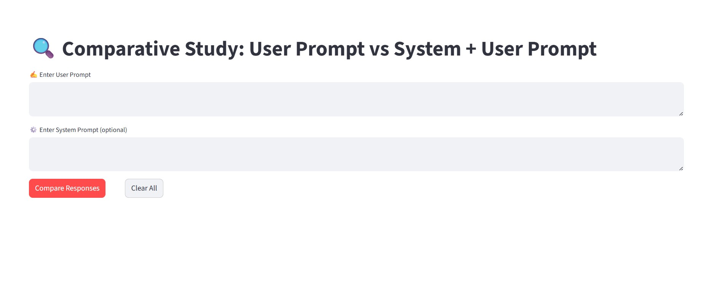
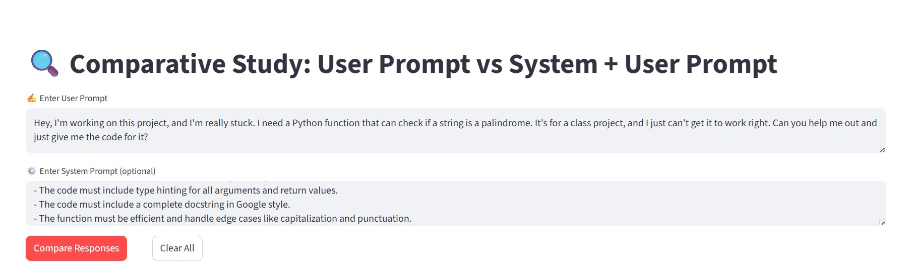

<!-- PROJECT HEADER -->
<div align="center">

# 🔍 **LLM Response Comparison Dashboard**

[](https://YOUR_STREAMLIT_APP_URL_HERE)
[](https://www.python.org/downloads/)
[](LICENSE)
[](https://github.com/YOUR_USERNAME)

_A visual and analytical dashboard to compare responses from generative AI models under two prompt configurations._

</div>

---

## 🌈 **Overview**

The **LLM Response Comparison Dashboard** provides a simple and powerful way to **visually compare, analyze, and quantify** how a generative model (Google’s `gemini-2.5-flash-preview-09-2025`) behaves under:

1. **User Prompt Only**
2. **System Prompt + User Prompt**

It’s built for **AI researchers, NLP developers, and prompt engineers** who want to measure — not guess — how prompts influence model performance.

<p align="center">
  <br><br>
  
</p>

---

## ⚡ **Core Features**

✨ **Side-by-Side Comparison**  
> Instantly see differences between plain user prompts and engineered (system + user) prompts.  

📊 **Automated Metrics**  
> Compare **token count**, **character length**, and **finish reason** automatically.  

🧠 **Smart Insights**  
> Generates a plain-English verdict on which response is more detailed, concise, or token-efficient.  

🧩 **Clean Architecture**  
> Decoupled backend (`app_backend.py`) for logic and frontend (`app_frontend.py`) for UI.  

🔍 **Raw API Viewer**  
> Inspect raw JSON responses from the API for debugging and transparency.

---

## 💡 **Why This Project?**

Prompt engineering is powerful — but often **hard to prove**.

This project provides a visual and analytical way to:
- ✅ **Quantify** the impact of a system prompt  
- 🔍 **Debug** prompt behavior for tone, structure, and coherence  
- 📈 **Demonstrate** measurable improvements to teams or clients  

> _“If you can measure it, you can improve it.”_ — Peter Drucker

---

## 🧠 **Tech Stack**

| Layer | Technology |
|--------|-------------|
| **Frontend** | [Streamlit](https://streamlit.io/) |
| **Backend** | [Python](https://www.python.org/) |
| **Model** | `gemini-2.5-flash-preview-09-2025` |
| **API Calls** | `requests` |
| **Data Handling** | `pandas` |
| **Visualization** | Streamlit components & Markdown UI |

---

## ⚙️ **Setup & Installation**

### 🪄 Step 1 — Clone the Repository
```bash
git clone https://github.com/YOUR_USERNAME/YOUR_REPO_NAME.git
cd YOUR_REPO_NAME
